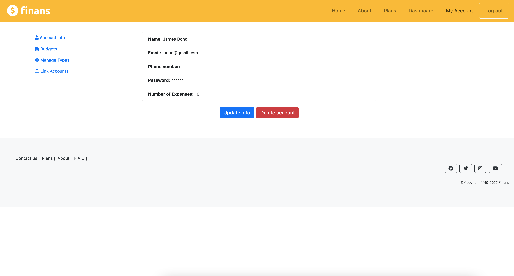
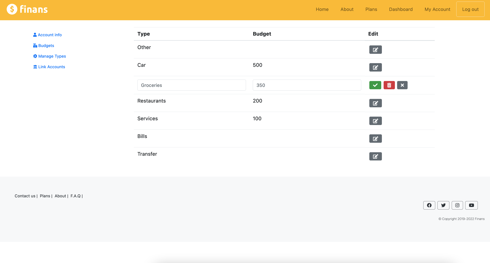

# Finans expense tracker

## Description:

An easy-to-use application that serves as an expense tracker. It creates a detailed record of expenses and provides several other tools to help manage them.

--

## Usage:
It is a very simple and straightforward app. The user can interact with the form fields to add, search, filter and delete transactions that are detailed with month, day, year, year, type, description and amount. There is also a field at the end of the table with the total amount of expenses displayed.

After log in and upon start, the app loads all existing expenses in the database at the dashboard and creates a table with the records. The user can then fill all the fields and click the add button to register a new transaction, which will promptly be added to the end of the table along with a success pop-up message with the transaction id.  If any field is missing or if incorrect information is passed, such as a year that contains a letter, an error message is displayed and the transaction is not added. Newest expenses are always displayed on top.
 
The user can also dynamically filter expenses based on the information contained in the fields. As an example, they can click the button to clear all the fields and then select only type Groceries, then click the filter button. That will search the database and rebuild the table only with expenses in the Groceries category. They can also add more filters, like for example search Groceries expenses in the month of October, and so on... The sum of expenses displayed at the end will also be updated to reflect the results of the search.

A button to search all expenses was also added to go back to the original state without having to refresh it.

Each expense in the table has a button at the end which toggles editable options where the user can modify any data, save or discard changes, as well as delete the entire row if needed.

Every new account starts with an "Other" type, which cannot be deleted. However, the user has the freedom to create and delete as many types of expenses as they wish, as well as assign specific budgets to it by clicking the yellow button in the form. If the user chooses to add a budget, an email notification will be sent alerting them when they reach 70% of their budgets, and then they exceed it.

The "My Account" link on the navbar takes the user to a menu with a few other features including the option to edit their account information as well as manage their types and budgets. From there, it is possible to analyze a detailed visual summary of all types and their budgets with progress bars and colors to help monitor their expenses. At the bottom of the "Budgets" page, there are also cards displaying the total budget, the amount for expenses inside their budgets, and finally the total amount spent, which includes extra expenses in types that do not have a budget set. The user can also compare with previous months by selecting the navigation buttons at the very end for an easy comparison. It fetches the data from different months from the database and updates the diagram.

In "Manage Types", it is possible to also edit types' names and budgets, or delete them if needed. When a type is deleted, all its expenses are automatically assigned to "Other", which is the default type.

Finally, from the My Account menu, the user also has the option to link their bank to automatically fetch transactions processed in their accounts and have them safely and securely added to Finans. New types will be created for transactions obtained according to the category received from the financial institution, but the user has the option to change their types in their Dashboard, as well as any other field they wish.

Every action where user input is provided is protected by reCAPTCHA v3, as well as by extensive front-end and back-end validators and sanitizers which cover updating, creation or deletion of expenses, types and user accounts/personal information. 

--

## Installation:
npm install

--

## Run with:
npm start

Developed by:
Gustavo Franca Faria 

--

## Build with:
Bootstrap v4.6
Node.js
React.js
React Router
Express.js
Express sessions
Express validator
MongoDB 
Webpack
Babel
Axios
Google reCAPTCHA v3
Google oAuth 2.0
Google analytics
Google cloud run
Passport
Upstash Redis
Twilio
FontAwesome v5.15.1
Plaid
Nodemailer

## Screenshots
#### Home Page

#### Log In

#### Resgiter

#### Contact

#### Create Types

#### Edit Expenses

#### Filter Expenses

#### Recurring Expenses

#### User Info

#### Edit User

#### Budgets

#### Manage Types

#### Bank Transactions

